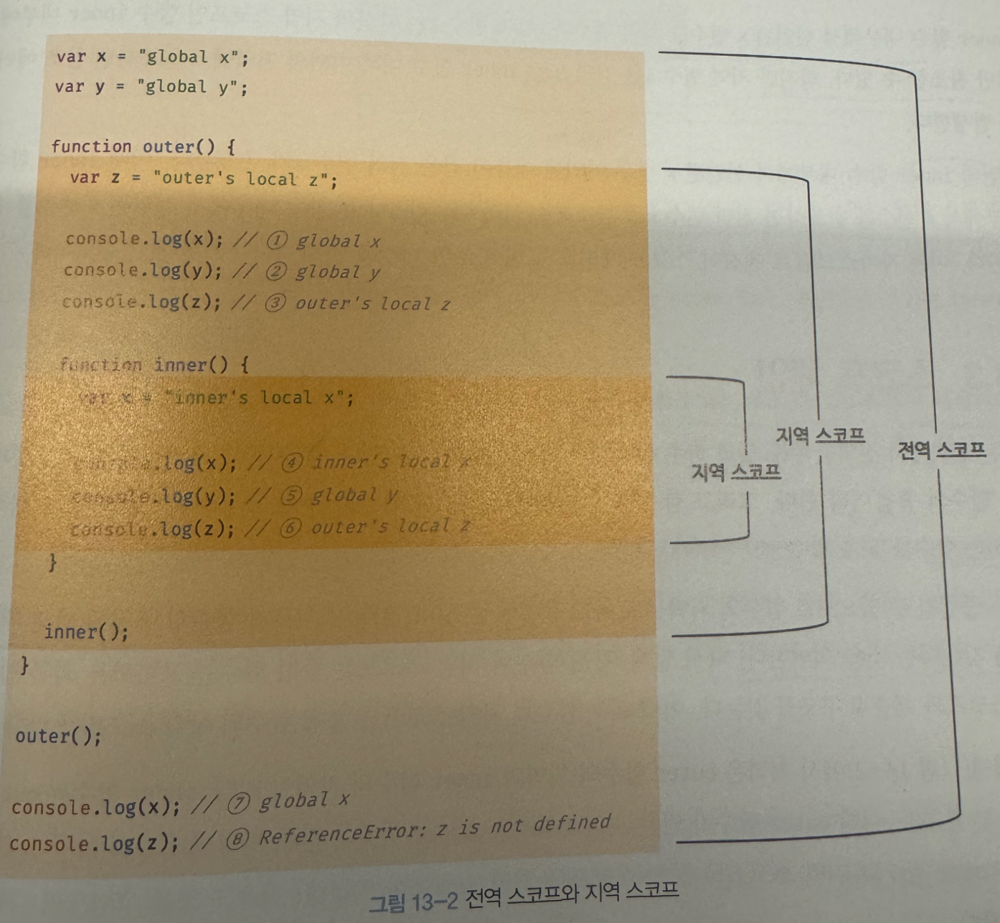

## 스코프

식별자가 유효한 범위

모든 식별자(변수 이름, 함수 이름, 클래스 이름 등) 자신이 선언된 위치에 의해 다른 코드가 식별자 자신을 참조할 수 있는  유효 범위

```jsx
var var1 = 1;
if (true) {
  var var2 = 2;
  if (true) {
    var var3 = 3;
  }
}

function foo() {
  var var4 = 4;

  function bar() {
    var var5 = 5;
  }
}

console.log(var1); // 1
console.log(var2); // 2
console.log(var3); // 3

// ReferenceError
// console.log(var4)
// console.log(var5)

```

**식별자 결정**

JS엔진이 스코프를 통해 어떤 변수를 참조할 것인지 결정하는 것

스코프 = 식별자를 사용할 때 사용하는 규칙

```jsx
var x = 'global';

function foo() {
  var x = 'local';
  console.log(x);
}

foo(); // local

console.log(x); // global
```

<aside>
💡

이름이 동일하나 스코프가 다른 별개의 변수 x

</aside>

스코프라는 개념을 통해 같은 이름을 가진 변수의 충돌 방지

스코프를 통해 식별자인 변수 이름의 충돌을 방지해 같은 이름의 변수를 사용할 수 있음

스코프 내에서 식별자의 이름은 유일. 다른 스코프에선 같은 이름의 식별자 사용 가능

스코프 = 네임스페이스

<aside>
💡

**var 키워드 선언 변수의 중복 선언**

var 키워드로 선언된 변수는 같은 스코프 내에서 중복 선언이 허용됨

의도치 않게 변수값이 재할당되어 변경되는 부작용 발생

```jsx
function foo() {
  var x = 1;
  
  var x = 2;
  console.log(x) // 2
}
foo();
```

let, const 선언된 변수는 같은 스코프내 중복 선언 허용 x

```jsx
function bar() {
  let x = 1;
  let x = 2; // syntaxError: Identifier 'x' has already been declared
}
```

</aside>

## 스코프 종류

| 구분 | 설명 | 스코프 | 변수 |
| --- | --- | --- | --- |
| 전역 | 코드의 가장 바깥 영역 | 전역 스코프 | 전역 변수 |
| 지역 | 함수 몸체 내부 | 지역 스코프 | 지역 변수 |

코드는 전역과 지역으로 구분

자신이 선언된 **위치**에 의해 자신이 유효한 범위인 스코프가 결정



### 전역과 전역 스코프

전역

- 코드의 가장 바깥 영역
- 전역에 변수 선언 시 전역 스코프를 가진 전역 변수 생성
- 전역 변수는 어디서든지 참조 가능
- 위 예제에서 x와 y는 전역 변수이며 어디선 참조할 수 있으므로, 함수 내부에서도 참조 가능

### 지역과 지역 스코프

지역

- 함수 몸체 내부. 지역 스코프를 만듦
- 지역에 변수 선언 시 지역 스코프를 갖는 지역 변수 생성
- 지역 변수는 자신이 선언된 지역과 하위 지역에서만 참조 가능
- **지역 변수는 자신의 지역 스코프와 하위 지역 스코프에서 유효**
- z는 지역 변수이며 지역 스코프를 가짐
    - 자신의 지역 스코프인 outer 함수 내부와 하위 지역 스코프인 inner 함수 내부에서 참조 가능
    - 지역 변수 z를 전역에서 참조하려 할 경우 Reference 에러 발생
- inner 함수 내 x도 지역 변수
    - 자신의 지역 스코프인 함수 inner 내부에서만 참조 가능
    - inner 함수 내부 이외의 지역에서 참조하면 Reference 에러 발생

**스코프는 다르지만 함수 내부에서 선언된 변수 x를 어떻게 전역 변수인 x가 아니라 지역 변수 x를 참조하는가?**

⇒ 자바스크립트 엔진이 **스코프 체인**을 통해 참조할 변수를 검색했기 때문

## 스코프 체인

스코프 체인

→ 스코프가 계층적으로 연결된 것. 모든 지역 스코프의 최상위 스코프는 전역 스코프

- 중첩

  함수 몸체 내부에서 함수가 정의된 것 → 함수의 중첩

  함수 몸체 내부에서 정의한 함수 → 중첩 함수

  중첩 함수를 포함하는 함수 → 외부 함수


<aside>
💡

**변수 검색**

변수 참조 시 JS 엔진은 스코프 체인을 통해 변수를 참조하는 코드의 스코프에서 시작하여 상위 스코프 방향으로 이동하며 선언된 변수를 검색

이를 통해 상위 스코프에서 선언한 변수를 하위 스코프에서도 참조 가능

JS 엔진은 위 그림과 유사한 자료구조인 렉시컬 환경을 실제로 생성

변수 선언이 실행되면 변수 식별자가 이 자료구조에 Key로 등록되고, 변수 할당이 일어나며 이 자료구조의 변수 식별자에 해당하는 값을 변경. 변수의 검색도 이 자료구조 상에서 이뤄짐

> **렉시컬 환경**
스코프 체인은 실행 컨텍스트의 렉시컬 환경을 단방향으로 연결한 것
전역 렉시컬 환경은 코드가 로드되면 곧바로 생성
함수의 렉시컬 환경은 함수가 호출되면 곧바로 생성
>
</aside>

### 스코프 체인에 의한 변수 검색


1. console.log(x)
    - x변수를 참조하는 코드의 스코프인 inner 함수의 지역 스코프에서 x 변수가 선언되었는지 검색
    - inner 함수 내 선언된 x변수가 존재하므로 해당 변수를 참조하고 검색 종료
2. console.log(y)
    - y변수를 참조하는 코드의 스코프인 inner 함수의 지역 스코프에서 y 변수가 선언되었는지 검색
    - 존재하지 않으므로 상위 스코프인 outer 함수의 지역 스코프로 이동
    - outer 함수 내에도 y 변수의 선언이 존재하지 않으므로 상위 스코핑ㄴ 전역 스코프로 이동
    - 전역 스코프에는 y 변수의 선언이 존재하므로 검색된 변수 참조 후 검색 종료
3. console.log(z)
    - 위와 같은 절차 진행 후 outer 함수 스코프로 이동
    - outer 함수 내 z 변수 선언 존재하므로 변수 참조 및 검색 종료

<aside>
💡

JS 엔진은 스코프 체인을 따라 변수를 참조하려는 코드의 스코프에서 시작해 상위 스코프 방향으로 이동하며 선언된 변수를 검색
하위 스코프로 내려가면서 식별자를 검색하는 일은 없다!

⇒ 상위 스코프에서 유효한 변수는 하위 스코프에서 자유롭게 참조할 수 있으나,
하위 스코프에서 유ㅛ한 변수를 상위 스코프에서 참조할 수 없다.

</aside>

### 스코프 체인에 의한 함수 검색

```jsx
function foo() {
  console.log('global foo')
}

function bar() {
  function foo() {
    console.log('local foo')
  }
  
  foo();
}

bar();
```

함수 선언문 함수 정의 시 런타임 이전 함수의 객체 생성

JS 엔진은 함수 이름과 동일한 이름의 식별자 암묵적 선언 후 생성된 함수 객체를 할당

함수 또한 변수와 마찬가지로 식별자 검색 규칙과 동일하게 bar 내부에서의 foo 함수 호출은 지역 스코프에서 선언된 foo 함수를 호출한다.

## 함수 레벨 스코프

지역 - 함수 몸체 내부, 스코프를 만듦

→ 코드 블록이 아닌 함수에 의해서만 지역 스코프 생성

<aside>
💡

**블록 레벨 스코프**

C나 자바와 같은 언어는 함수 몸체뿐만 아니라 모든 코드 블록(if, for, while 등)이 지역 스코프를 만든다. 이러한 특성을 **블록 레벨 스코프**라 한다.

</aside>

<aside>
💡

**함수 레벨 스코프**

var 키워드로 선언된 변수는 오직 함수의 코드 블록만을 지역 스코프로 인정한다

</aside>

```jsx
var x = 1;

if (true) {
  // var 키워드 변수는 함수의 코드 블록만을 지역 스코프로 인정
  // 함수 밖에서 var 키워드로 선언된 변수는 코드 블록 내에서 선언되었다 할지라도 모두 전역 변수
  // 따라서 여기 x는 전역 변수. 이미 선언한 var 변수가 있으므로 중복 선언
  // 의도치 않게 변수 값이 변경되는 부작용 발생
  var x = 10;
}
console.log(x); // 10

var i = 10;

for (var i = 0; i < 5; i++) {
  console.log(i; // 0, 1, 2, 3, 4)
}

// 위와 동일하게 의도치 않게 변수의 값이 변경
console.log(i); // 5
```

위와 같이 var 키워드는 오직 함수의 코드 블록만을 지역 스코프로 인정하여 의도치 않게 변수의 값이 변경되는 문제 발생

ES6에 도입된 let, const 키워드는 블록 레벨 스코프를 지원하여 이러한 문제에서 벗어날 수 있음

## 렉시컬 스코프

함수를 어디에서 호출했는지가 아니라 함수를 어디서 정의했는지에 따라 상위 스코프를 결정

함수의 상위 스코프는 함수 정의가 실행될 때 정적으로 결정

즉, 함수의 상위 스코프는 언제나 자신이 정의된 스코프

함수 정의가 실행되어 생성된 함수 객체는 위치를 통해 결정된 상위 스코프를 기억하며, 호출될 때마다 함수의 상위 스코프를 참조

```jsx
var x = 1;

function foo() {
  var x = 10;
  bar();
}

function bar() {
  console.log(x);
}

foo(); // 1
bar(); // 1
```

자바스크립트는 함수가 정의된 위치를 기준으로 스코프를 결정

bar 함수가 정의된 위치는 전역 스코프

따라서 bar 함수는 x 라는 변수를 참조 시 bar 함수의 상위 스코프인 전역 스코프에서 선언된 x를 참조

만약

```jsx
var x = 1;

function foo() {
  var x = 10;
  bar();
  function check() {
    console.log(x);
  }
  check()
}

function bar() {
  console.log(x);
}

foo(); // 1, 10
bar(); // 1

// -> 1
// -> 10
// -> 1
```

foo 함수가 호출되면 bar 함수는 자신의 상위 스코프인 전역 스코프에 선언된 변수 x 참조 후 출력

이후 check 함수는 자신의 스코프에서 시작해 foo 함수 내부에서 선언된 변수 x를 참조 후 출력

---

이러한 렉시컬 스코프는 클로저와 깊은 관계가 있으며

실행 컨텍스트, 렉시컬 환경, 환경 레코드 등과 관련이 있다

실행 컨텍스트 - 코드가 실행될 때마다 생성되는 실행 단위

렉시컬 환경 - 실행 컨텍스트 내부에 포함되는 식별자와 그 값이 저장되는 공간. 환경 레코드와 외부 렉시컬 환경 참조로 구성

```jsx
실행 컨텍스트 = {
  LexicalEnvironment: {...},
  VariableEnvironment: {...},
  ThisBinding: ...
}
```

환경 레코드 - 렉시컬 환경의 구성 요소로 실제 변수들이 저장되는 곳

외부 렉시컬 환경 참조 - 상위 스코프를 가리킴

클로저 - 함수가 자신이 생성될 당시의 외부 렉시컬 환경을 기억하고 실행이 끝난 뒤 그 환경에 접근할 수 있는 현상

클로저는 렉시컬 스코프 규칙과 렉시컬 환경 구조가 결합된 결과물인 것
